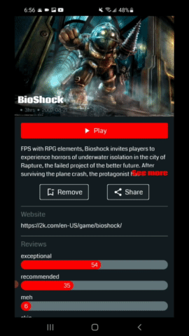

# :video_game:Video Game Finder:video_game:
Video Game Finder is an android application that will allow users to browse a a variety of video games.

  

This application includes:
- Search bar to find a specific game:heavy_check_mark:
- Option to favorite a game to view whenever you would like:heavy_check_mark:
- Option to navigate to a video games webiste:heavy_check_mark:
- Option to view a games details:heavy_check_mark:
- Option to recieve notifications:heavy_check_mark:
- Option to change the applications theme:heavy_check_mark:
## Motivation
The purpose of this application is to demonstrate my android development skills.
This application consists of libraries and best practices such as:
  1. Jetpack Compose:heavy_check_mark:
  2. MVVM/MVI architecture (clean architecture):heavy_check_mark:
  3. Retrofit(+ GSON):heavy_check_mark:
  4. Dagger Hilt:heavy_check_mark:
  5. Room (local database):heavy_check_mark:
  6. Unit testing (with Junit 5 and Mockweb server):heavy_check_mark:
  7. Accompanist (Coil):heavy_check_mark:
  8. Android Jetpack (DataStore, WorkManager):heavy_check_mark:
## :camera:Screenshots:camera:

  
  
  

## Framework
**Built with**
- [Jetpack Compose](https://developer.android.com/jetpack/compose)
- [Retrofit](https://square.github.io/retrofit/)
- [Dagger-Hilt](https://developer.android.com/training/dependency-injection/hilt-android)
- [Room](https://developer.android.com/training/data-storage/room)
- [Junit 5](https://github.com/mannodermaus/android-junit5)
- [Coil](https://github.com/google/accompanist/tree/main/coil)
- [Android Jetpack](https://developer.android.com/jetpack)
- [Connectivity Manager](https://developer.android.com/guide/topics/connectivity)
- [Gson](https://github.com/square/retrofit/tree/master/retrofit-converters/gson)
- [MockwebServer](https://github.com/square/okhttp/tree/master/mockwebserver)

## API Reference
- [RAWG Video Games Database API](https://rawg.io/apidocs):computer:

## License
    Copyright 2021 Daniel Toriz Valdovinos
